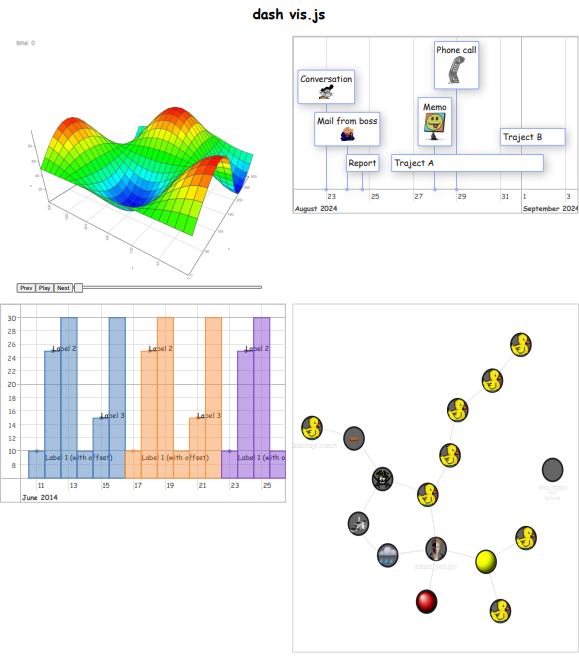

# Dash-vis


[](https://github.com/ambv/black)


[](https://community.plotly.com/t/django-dash-token-authentication/82088)



`dash-vis.js` is a base template for how one could connect vis.js components within a dash application.

## Features

- **Graph2D:** base 2d graph template
- **Graph3D:** base animated 3d graph template.
- **Network:** base network graph template.
- **Timeline:** base timeline graph template.


## Getting Started

To get started with `dash-vis.js`, clone this repository to your local machine:

```bash
git clone https://github.com/pip-install-python/dash-vis.git
cd vis_dash
```
Ensure you have the following installed:

- Python (3.8.18 or later)
- pip
- Virtual environment (recommended)

### Installation
1. Create and activate a virtual environment:

Windows:
```
python -m venv venv
.\venv\Scripts\activate
macOS/Linux:
```

macOS/Linux
```
python3 -m venv venv
source venv/bin/activate
```

2. Install the required packages:

```
pip install -r requirements.txt
```

### Running Examples
Navigate to app.py and execute the application:

```
python app.py
```
### Documentation
For more detailed information about dash-frontend and its components, visit our documentation page.

### Contributing
Contributions are what make the open-source community such an amazing place to learn, inspire, and create.

### Contact
Pip Install Python

Project Link: https://github.com/pip-install-python/dash-vis


